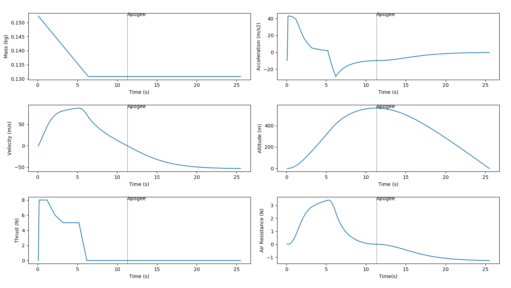
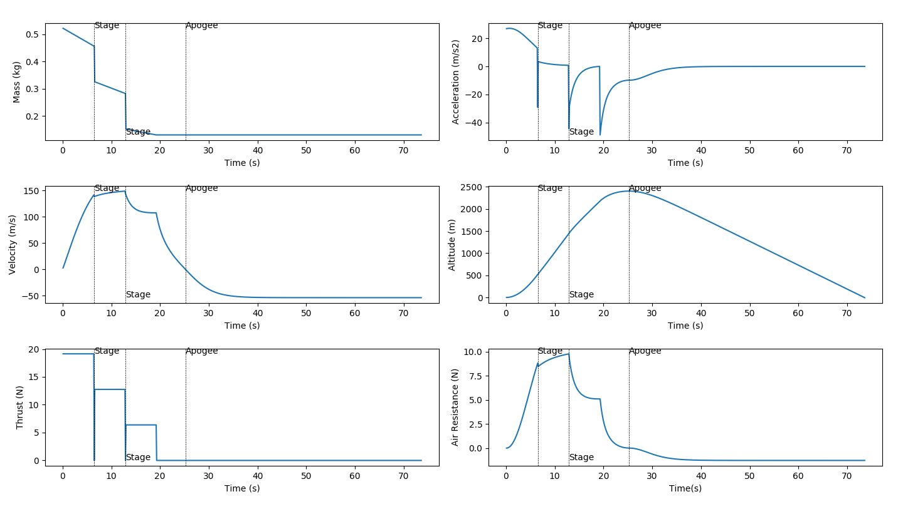

# Rocket Simulator
Given a description of a rocket, the program simulates the mass, thrust, acceleration, velocity, altitude, and air-resistance of the rocket as it flies directly upwards. Below shows some example rockets.

### Single Stage 

### Single Stage (Variable Thrust)

### Single Stage with Parachute

### Three Stage
